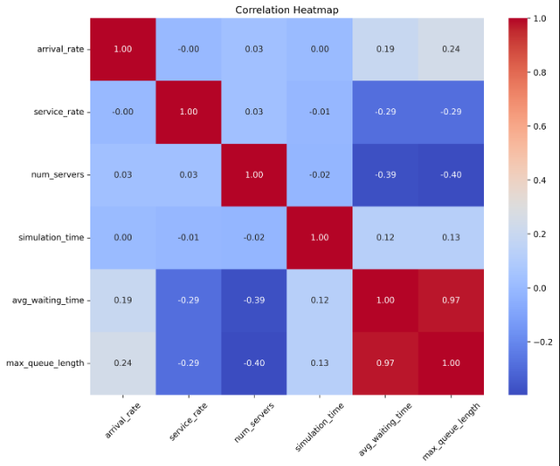
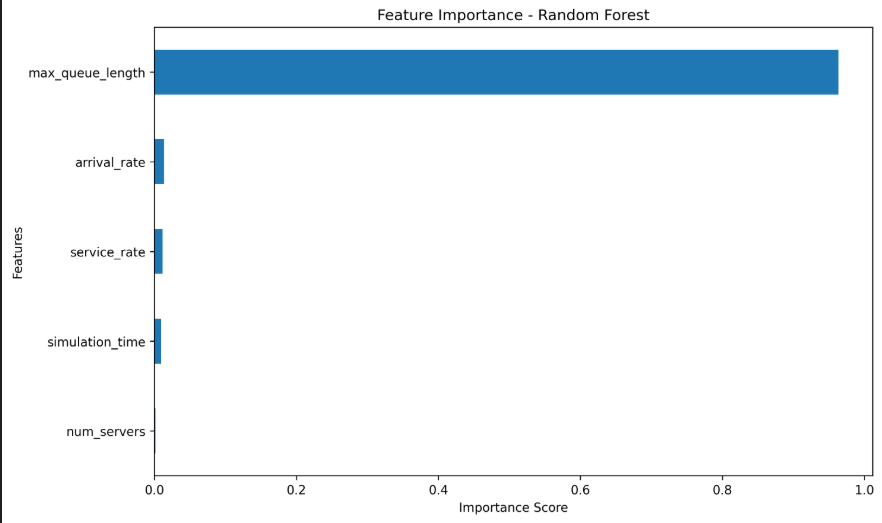
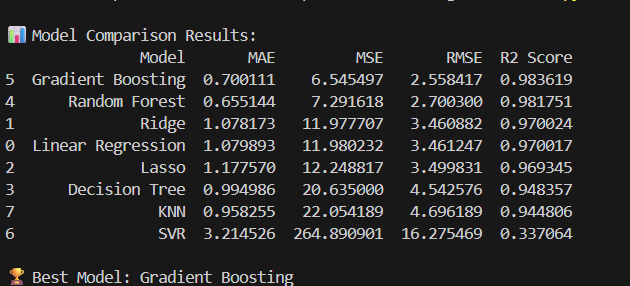

# 📊 Data Generation using Modelling and Simulation for Machine Learning

---

## 📌 Project Overview

This project demonstrates how synthetic data can be generated using simulation modeling and then utilized to train and evaluate multiple Machine Learning models.

A bank queue system was simulated using **SimPy (Discrete Event Simulation Library in Python)**.  
A total of **1000 simulations** were executed with randomized parameters to generate a structured dataset.

The objective of this project is to:

- Generate synthetic data using simulation
- Train multiple regression models
- Compare performance using evaluation metrics
- Identify the best performing model

---

# 🧠 Methodology

The project consists of three major phases:

---

## 1️⃣ Simulation Modeling

A discrete-event **Bank Queue System** was modeled where:

- Customers arrive randomly (Arrival Rate)
- Service time is randomly distributed (Service Rate)
- Multiple service counters are available
- Simulation runs for a specified duration

### 📌 Parameters Used

| Parameter        | Lower Bound | Upper Bound |
|------------------|------------|------------|
| Arrival Rate     | 0.5        | 2.0        |
| Service Rate     | 0.5        | 2.5        |
| Number of Servers| 1          | 5          |
| Simulation Time  | 100        | 500        |

Each simulation outputs:

- Average Waiting Time (Target Variable)
- Maximum Queue Length

---

## 2️⃣ Dataset Generation

- 1000 simulations were executed.
- Parameters were randomly sampled within defined bounds.
- Final dataset stored in:

```
simulation_data.csv
```

Dataset Features:

- arrival_rate  
- service_rate  
- num_servers  
- simulation_time  
- avg_waiting_time (Target)  
- max_queue_length  

---

# 📊 Exploratory Data Analysis

## 🔥 Correlation Analysis

The correlation heatmap shows relationships between system parameters and waiting time.

Key Observations:

- Higher arrival rate increases waiting time.
- Higher service rate reduces waiting time.
- More servers significantly reduce congestion.
- Maximum queue length is strongly correlated with waiting time.

### 📷 Heatmap Screenshot



---

## 📈 Feature Importance (Random Forest)

Feature importance was computed using Random Forest Regressor to understand which parameters influence waiting time the most.

Observations:

- Arrival rate has strong influence.
- Number of servers significantly impacts waiting time.
- Service rate reduces congestion.
- Maximum queue length is highly correlated with waiting time.

### 📷 Feature Importance Screenshot



---

# 🤖 Machine Learning Models Used

The following 8 regression models were trained:

1. Linear Regression  
2. Ridge Regression  
3. Lasso Regression  
4. Decision Tree Regressor  
5. Random Forest Regressor  
6. Gradient Boosting Regressor  
7. Support Vector Regressor (SVR)  
8. K-Nearest Neighbors (KNN)  

---

# 📏 Evaluation Metrics

Each model was evaluated using:

- MAE (Mean Absolute Error)
- MSE (Mean Squared Error)
- RMSE (Root Mean Squared Error)
- R² Score

Model comparison results are stored in:

```
model_comparison.csv
```

---

# 🏆 Results

- Ensemble methods outperformed linear models.
- Gradient Boosting / Random Forest achieved highest R² score.
- The system exhibits non-linear behavior.
- Arrival rate and number of servers are dominant influencing factors.

### 📷 Model Results Screenshot



---

# 📂 Project Structure

```
ML_Simulation_Assignment/
│
├── simulation.py
├── ml_models.py
├── simulation_data.csv
├── model_comparison.csv
├── correlation_heatmap.png
├── feature_importance.png


```

---

# 🛠️ How to Run

### 1️⃣ Create Virtual Environment (Recommended)

```
python -m venv venv
venv\Scripts\activate
```

### 2️⃣ Install Dependencies

```
pip install -r requirements.txt
```

### 3️⃣ Run Simulation

```
python simulation.py
```

### 4️⃣ Run Machine Learning Models

```
python ml_models.py
```

---

# 📌 Conclusion

This project successfully integrates:

- Simulation Modeling
- Synthetic Data Generation
- Machine Learning Model Comparison
- Performance Evaluation

Results indicate that ensemble learning models capture the complex non-linear relationships of the simulated system more effectively than linear models.

This demonstrates the practical integration of modeling, simulation, and machine learning in predictive system analysis.

---

# 👩‍💻 Author

Palak  
Machine Learning Project  
